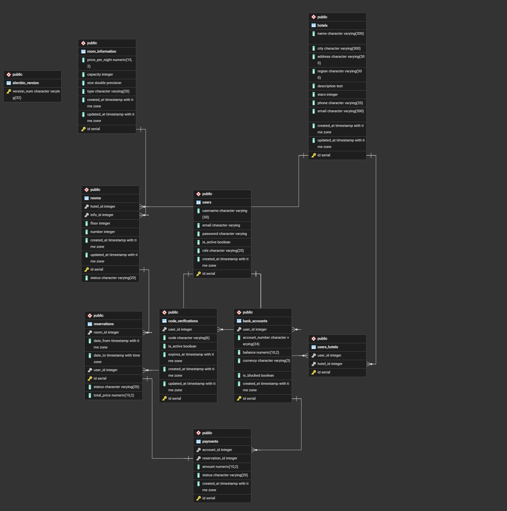

# 🏨 Hotel Booking & Financial System API

Современное RESTful API для системы бронирования отелей, управления номерами и обработки внутренних платежей. Проект построен на асинхронном стекe Python с использованием ролевой модели доступа, фоновых задач и кэширования.

---

## 🛠 Технологический стек

* **Язык / Фреймворк:** Python 3.14, FastAPI
* **База данных / ORM:** PostgreSQL, SQLAlchemy (Async), Alembic (Миграции)
* **Брокер сообщений / Очередь задач:** RabbitMQ, Taskiq
* **Кэширование & In-Memory:** Redis
* **Аутентификация & Безопасность:** JWT (JSON Web Tokens), Passlib / Bcrypt (Хеширование паролей)
* **Деплой & Контейнеризация:** Docker, Docker Compose

---

## ✨ Ключевой функционал

### 1. 🔐 Аутентификация и Ролевая модель (RBAC)
* Разграничение прав доступа на основе ролей (**Customer**, **Manager**, **Admin**).
* Безопасная аутентификация через **JWT tokens**.
* Хеширование паролей пользователей.

### 2. 🏨 Управление Отелями и Номерами (CRUD)
* Создание, чтение, обновление и удаление отелей и номеров (`hotel_logic`).
* Детализированная информация о номерах: категории, вместимость, этажи, стоимость за ночь.
* Связь менеджеров и пользователей с отелями.

### 3. 💳 Банковские аккаунты и 2FA-подтверждение
* Создание и управление балансом виртуальных банковских аккаунтов (`bank_accounts`).
* Пополнение счета с защитой через **двухфакторную верификацию (2FA)**.
* Фоновая отправка 6-значных одноразовых кодов подтверждения на Email через **Taskiq + RabbitMQ**.
* Автоматическая отмена и истечение срока действия устаревших кодов.

### 4. 📅 Система Бронирования
* Бронирование номеров на выбранные даты с автоматическим расчетом итоговой стоимости.
* Отслеживание статусов бронирований и платежей (`PENDING`, `CONFIRMED`, `CANCELLED`).

---

## 📐 Схема базы данных

Проект использует реляционную структуру PostgreSQL с четкими связями (One-to-Many, Many-to-Many) между пользователями, отелями, бронированиями и платежами.



---

## 📁 Структура проекта

Проект организован по модульному принципу:

```text
FastAPI_Practic/
├── core/                         # Ядро приложения
│   ├── models/                   # SQLAlchemy модели (User, Hotel, Room, Reservation и др.)
│   ├── tasks/                    # Taskiq таски (отправка писем и уведомлений)
│   ├── utils/                    # Вспомогательные сервисы (Mailing, Permissions, Mixins)
│   ├── broker_taskiq.py          # Конфигурация RabbitMQ брокера
│   ├── database.py               # Сессия БД и подключение
│   └── config.py                 # Настройки Pydantic Settings
│   └── loggin_system.py          # Настройка логирование приложения
├── hotel_logic/                  # Модуль управления отелями и номерами
│   ├── cruds/                    # CRUD операции
│   └── views/                    # API Endpoints
├── payment_reservation_logic/    # Модуль платежей и бронирования
│   ├── crud/                     # CRUD аккаунтов, платежей и броней
│   ├── views/                    # API Endpoints
│   └── service.py                # Бизнес-логика проводимых операций
├── users_logic/                  # Модуль пользователей и аутентификации
│   ├── views/                    # Авторизация и профиль
│   └── security.py               # Генерация JWT и проверка прав
├── alembic/                      # Миграции базы данных
├── docker-compose.yml            # Оркестрация сервисов (App, DB, Redis, RabbitMQ, Worker)
├── Dockerfile                    # Сборка образа FastAPI
└── main.py                       # Точка входа в FastAPI приложение

```
---

## команды для локальной разработки, отладки и тестирования сервисов.

### Запуск компонентов проекта

* **Запуск FastAPI сервера:**
  ```bash
  uvicorn main:app --reload
  
* **Запуск отдельного контейнера Redis:**
  ```bash
  docker run -d --name redis-container -p 6379:6379 redis:alpine
  
* **Запуск отдельного контейнера RabbitMQ (с веб-админкой):**
  ```bash
  docker run -d --name rabbitmq-container -p 5672:5672 -p 15672:15672 rabbitmq:3-management
  
* **Подключение к консоли Redis (redis-cli) внутри контейнера:**
  ```bash
  docker exec -it redis-container redis-cli
  
* **Запуск вокера для taskiq:**
  ```bash
  taskiq worker core:broker -fsd --tasks-pattern "core/tasks/*.py"
  
* **Полный запуск всего окружения через Docker Compose:**
  ```bash
  docker-compose up --build -d
  
* **Полный запуск всего окружения через Docker Compose:**
  ```bash
  docker-compose down